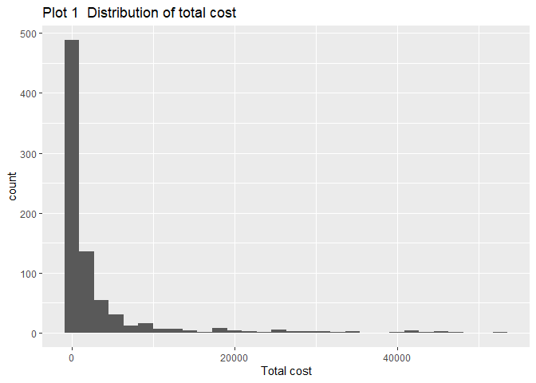
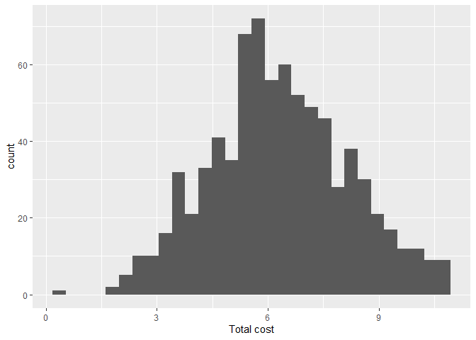
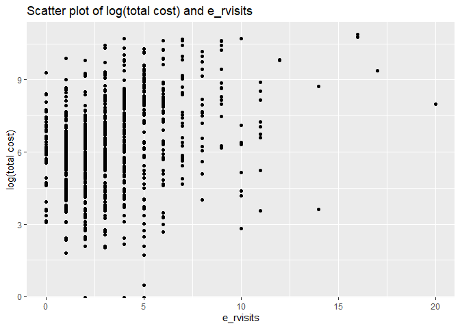

p8130_hw4
================
2022-11-13

``` r
library(tidyverse)
```

    ## ── Attaching packages ─────────────────────────────────────── tidyverse 1.3.2 ──
    ## ✔ ggplot2 3.4.0      ✔ purrr   0.3.5 
    ## ✔ tibble  3.1.8      ✔ dplyr   1.0.10
    ## ✔ tidyr   1.2.1      ✔ stringr 1.4.1 
    ## ✔ readr   2.1.3      ✔ forcats 0.5.2 
    ## ── Conflicts ────────────────────────────────────────── tidyverse_conflicts() ──
    ## ✖ dplyr::filter() masks stats::filter()
    ## ✖ dplyr::lag()    masks stats::lag()

``` r
library(BSDA)
```

    ## Loading required package: lattice
    ## 
    ## Attaching package: 'BSDA'
    ## 
    ## The following object is masked from 'package:datasets':
    ## 
    ##     Orange

``` r
library(readxl)
library(arsenal)
library(knitr)
```

# Problem 1

``` r
blood_data = c(125,123, 117, 123, 115, 112, 128 ,118, 124, 111, 116, 109 ,125,
               120 ,113, 123, 112, 118, 121 ,118, 122, 115,
               105, 118, 131)

SIGN.test(blood_data, md=120,alternative = "less")
```

    ## 
    ##  One-sample Sign-Test
    ## 
    ## data:  blood_data
    ## s = 10, p-value = 0.2706
    ## alternative hypothesis: true median is less than 120
    ## 95 percent confidence interval:
    ##      -Inf 122.1203
    ## sample estimates:
    ## median of x 
    ##         118 
    ## 
    ## Achieved and Interpolated Confidence Intervals: 
    ## 
    ##                   Conf.Level L.E.pt   U.E.pt
    ## Lower Achieved CI     0.9461   -Inf 122.0000
    ## Interpolated CI       0.9500   -Inf 122.1203
    ## Upper Achieved CI     0.9784   -Inf 123.0000

``` r
wilcox.test(blood_data, mu = 120, alternative = "less")
```

    ## Warning in wilcox.test.default(blood_data, mu = 120, alternative = "less"):
    ## cannot compute exact p-value with ties

    ## Warning in wilcox.test.default(blood_data, mu = 120, alternative = "less"):
    ## cannot compute exact p-value with zeroes

    ## 
    ##  Wilcoxon signed rank test with continuity correction
    ## 
    ## data:  blood_data
    ## V = 112.5, p-value = 0.1447
    ## alternative hypothesis: true location is less than 120

# Problem 2

## a)

``` r
brain_data= read_excel("C:/Users/lenovo/Downloads/Brain.xlsx") %>%
  janitor::clean_names() 


non_human_reg= brain_data %>%
  filter(species!="Homo sapiens") %>% 
  lm(glia_neuron_ratio~ln_brain_mass,data= .)
summary(non_human_reg)
```

    ## 
    ## Call:
    ## lm(formula = glia_neuron_ratio ~ ln_brain_mass, data = .)
    ## 
    ## Residuals:
    ##      Min       1Q   Median       3Q      Max 
    ## -0.24150 -0.12030 -0.01787  0.15940  0.25563 
    ## 
    ## Coefficients:
    ##               Estimate Std. Error t value Pr(>|t|)    
    ## (Intercept)    0.16370    0.15987   1.024 0.322093    
    ## ln_brain_mass  0.18113    0.03604   5.026 0.000151 ***
    ## ---
    ## Signif. codes:  0 '***' 0.001 '**' 0.01 '*' 0.05 '.' 0.1 ' ' 1
    ## 
    ## Residual standard error: 0.1699 on 15 degrees of freedom
    ## Multiple R-squared:  0.6274, Adjusted R-squared:  0.6025 
    ## F-statistic: 25.26 on 1 and 15 DF,  p-value: 0.0001507

## b)

The relationship between glia-neuron ratio (denote as $GR$) and brain
mass (denote as $BM$) is: $$\widehat{GR}=0.16370+0.18113\times\ln(BM)$$

the glia-neuron ratio of Homo sapiens should be:

$$\widehat{GR}=0.16370+0.18113\times7.22=1.471$$

## c)

We find that the glia neuron ratio for human is 1.65, which is higher
than other species. Therefore, the prediction interval interval for a
single new observation is more appropriate since the value of glia
neuron ratio for human can be considered as a new value. The predicted
mean glia- neuron ratio at the given brain mass can only capture
information of the given data.

## d)

``` r
new_brain = brain_data %>% 
  filter(species == "Homo sapiens")

interval = as.tibble(
  predict(non_human_reg, new_brain, interval="predict"),
) %>% 
  mutate(category = c("predict"))
```

    ## Warning: `as.tibble()` was deprecated in tibble 2.0.0.
    ## ℹ Please use `as_tibble()` instead.
    ## ℹ The signature and semantics have changed, see `?as_tibble`.

``` r
knitr::kable(interval)
```

|      fit |      lwr |      upr | category |
|---------:|---------:|---------:|:---------|
| 1.471458 | 1.036047 | 1.906869 | predict  |

``` r
brain_data %>% 
  filter(species!="Homo sapiens") %>% 
  dplyr::select(glia_neuron_ratio) %>% 
  summary()
```

    ##  glia_neuron_ratio
    ##  Min.   :0.46     
    ##  1st Qu.:0.64     
    ##  Median :1.02     
    ##  Mean   :0.94     
    ##  3rd Qu.:1.15     
    ##  Max.   :1.22

the true value of human brain after log transformation falls in the
prediction interval of non-human distribution, thus human brain do not
have excessive glia-neuron ratio for its mass

## e)

As seen from the plot, we can see that the glia neuron ration for human
exceeds other specie’s ratio. So the prediction of human from this model
may not be appropriate enough.

# Problem 3

``` r
heart_data= read_csv("C:/Users/lenovo/Downloads/HeartDisease.csv")%>%
  janitor::clean_names()
```

    ## Rows: 788 Columns: 10
    ## ── Column specification ────────────────────────────────────────────────────────
    ## Delimiter: ","
    ## dbl (10): id, totalcost, age, gender, interventions, drugs, ERvisits, compli...
    ## 
    ## ℹ Use `spec()` to retrieve the full column specification for this data.
    ## ℹ Specify the column types or set `show_col_types = FALSE` to quiet this message.

## a)

``` r
stat_data =tableby( ~ totalcost + age + gender +
                                  interventions + drugs+
                                  e_rvisits+complications+
                                  comorbidities+duration, 
                                data  = heart_data,
                                test  = FALSE, 
                                total = FALSE,
                                numeric.stats = c("meansd" ,"medianq1q3","range" ) )
sum = summary(stat_data,text = TRUE)
sum
```

    ## 
    ## 
    ## |                   |       Overall (N=788)       |
    ## |:------------------|:---------------------------:|
    ## |totalcost          |                             |
    ## |-  Mean (SD)       |     2799.956 (6690.260)     |
    ## |-  Median (Q1, Q3) | 507.200 (161.125, 1905.450) |
    ## |-  Range           |      0.000 - 52664.900      |
    ## |age                |                             |
    ## |-  Mean (SD)       |       58.718 (6.754)        |
    ## |-  Median (Q1, Q3) |   60.000 (55.000, 64.000)   |
    ## |-  Range           |       24.000 - 70.000       |
    ## |gender             |                             |
    ## |-  Mean (SD)       |        0.228 (0.420)        |
    ## |-  Median (Q1, Q3) |    0.000 (0.000, 0.000)     |
    ## |-  Range           |        0.000 - 1.000        |
    ## |interventions      |                             |
    ## |-  Mean (SD)       |        4.707 (5.595)        |
    ## |-  Median (Q1, Q3) |    3.000 (1.000, 6.000)     |
    ## |-  Range           |       0.000 - 47.000        |
    ## |drugs              |                             |
    ## |-  Mean (SD)       |        0.447 (1.064)        |
    ## |-  Median (Q1, Q3) |    0.000 (0.000, 0.000)     |
    ## |-  Range           |        0.000 - 9.000        |
    ## |e_rvisits          |                             |
    ## |-  Mean (SD)       |        3.425 (2.637)        |
    ## |-  Median (Q1, Q3) |    3.000 (2.000, 5.000)     |
    ## |-  Range           |       0.000 - 20.000        |
    ## |complications      |                             |
    ## |-  Mean (SD)       |        0.057 (0.248)        |
    ## |-  Median (Q1, Q3) |    0.000 (0.000, 0.000)     |
    ## |-  Range           |        0.000 - 3.000        |
    ## |comorbidities      |                             |
    ## |-  Mean (SD)       |        3.766 (5.951)        |
    ## |-  Median (Q1, Q3) |    1.000 (0.000, 5.000)     |
    ## |-  Range           |       0.000 - 60.000        |
    ## |duration           |                             |
    ## |-  Mean (SD)       |      164.030 (120.916)      |
    ## |-  Median (Q1, Q3) |  165.500 (41.750, 281.000)  |
    ## |-  Range           |       0.000 - 372.000       |

In this dataset, the main outcome is `total cost`, . Other important
covariate including the age and gender of the subscriber, number of
complications that arouse during treatment, and duration of treatment
condition. According to the plot above, The possible important
predictors are likely to be `complications`, `drugs` and `ERvisits` and
`interventions`.

## b)

``` r
heart_data %>% 
  ggplot(aes(totalcost))+
  geom_histogram()+
  labs(x = "Total cost",
       title = "Plot 1  Distribution of total cost")
```

    ## `stat_bin()` using `bins = 30`. Pick better value with `binwidth`.

<!-- -->

``` r
heart_log = 
  heart_data %>% 
  mutate(log_totalcost = log(totalcost))

plot =
  heart_log %>% 
  ggplot(aes(log_totalcost))+
  geom_histogram()+
  labs(x = "Total cost")
plot
```

    ## `stat_bin()` using `bins = 30`. Pick better value with `binwidth`.

    ## Warning: Removed 3 rows containing non-finite values (`stat_bin()`).

<!-- -->

## c)

``` r
heart_new = 
  heart_log %>% 
  mutate(comp_bin = 
           case_when(
             complications == 0 ~ "0",
             complications != 0 ~ "1"))
```

## d)

``` r
heart_new %>% 
  mutate(log_totalcost = log(totalcost)) %>% 
  ggplot(aes(y = log_totalcost, x = e_rvisits))+
  geom_point()+
  labs(x = "e_rvisits",
       y = "log(total cost)",
       title = "Scatter plot of log(total cost) and e_rvisits")
```

<!-- -->

``` r
heart_new_data= 
  heart_new %>% 
  filter(log_totalcost >= 0 )

fit = lm(log_totalcost ~ e_rvisits,heart_new_data)
summary(fit)
```

    ## 
    ## Call:
    ## lm(formula = log_totalcost ~ e_rvisits, data = heart_new_data)
    ## 
    ## Residuals:
    ##     Min      1Q  Median      3Q     Max 
    ## -6.2013 -1.1265  0.0191  1.2668  4.2797 
    ## 
    ## Coefficients:
    ##             Estimate Std. Error t value Pr(>|t|)    
    ## (Intercept)  5.53771    0.10362   53.44   <2e-16 ***
    ## e_rvisits    0.22672    0.02397    9.46   <2e-16 ***
    ## ---
    ## Signif. codes:  0 '***' 0.001 '**' 0.01 '*' 0.05 '.' 0.1 ' ' 1
    ## 
    ## Residual standard error: 1.772 on 783 degrees of freedom
    ## Multiple R-squared:  0.1026, Adjusted R-squared:  0.1014 
    ## F-statistic:  89.5 on 1 and 783 DF,  p-value: < 2.2e-16
